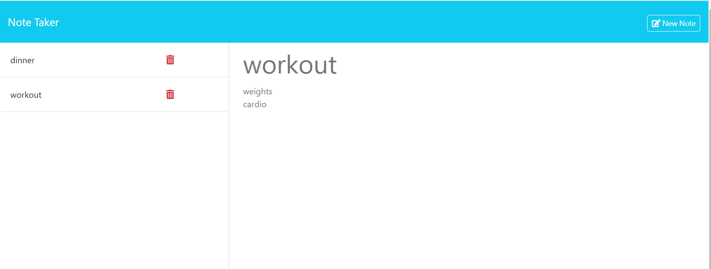

# Note Taker

## Table of Contents
* [Description](#description)
* [Usage](#usage)
* [Installation](#installation)
* [Tests](#tests)
* [Contributing](#contributing)
* [Questions](#questions)
* [License](#license)

## Description
Application that can be used to write, save, and delete notes. The application uses an  Express.js back end and will save and retrieve note data from a JSON file

## Screen shot

## Application URL

## Usage
Open the link to the Note Taker application URL, and click on the 'Get Started' button. You are then taken to a landing page with a link to a notes page. The notes page shows existing notes on the left-hand column, plus empty fields to enter a new note and title. When a new note and title are entered, a 'Save Note' and a 'Clear Form' button appear in the navigation at the top. When save is clicked the note is saved and appears in the left-hand column with the existing notes and the buttons disappear. When an existing note is clicked in the left hand column its contents are displayed in the right hand column and a 'New Note" button appears in the navigation. When the 'New Note' button is clicked , then empty fields are displayed which allow entering a note title and note text. Existing notes may be deleted by clicking on the trashcan icon next to the note in the left-hand column.

## Installation
N/A

## Tests
N/A

## Contributing
See contact info

## Questions
Github : [Profile](https://github.com/milindmjoshi)

Email: [milindmjoshi@gmail.com](mailto:milindmjoshi@gmail.com)
 
## License
[Apache](https://opensource.org/licenses/Apache-2.0)
    
